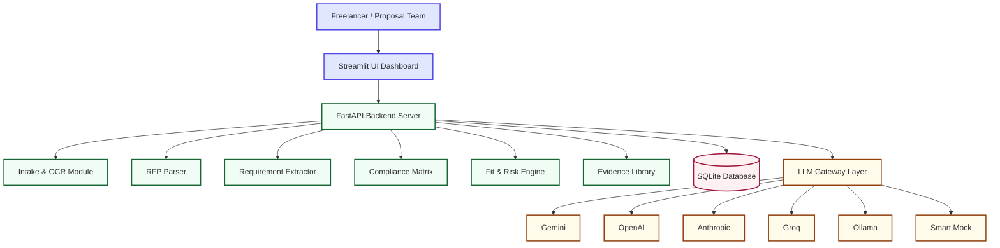
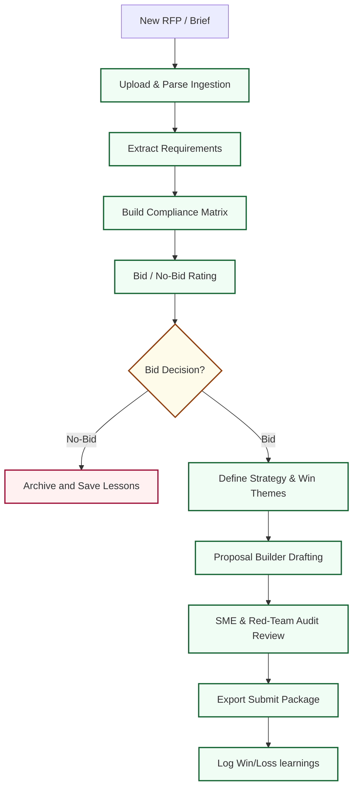
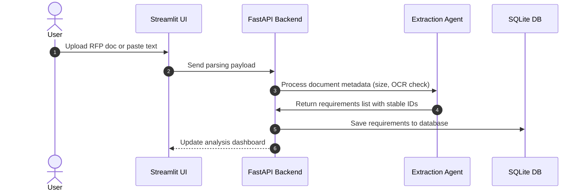
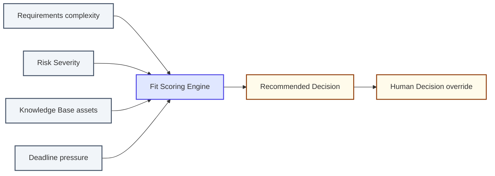
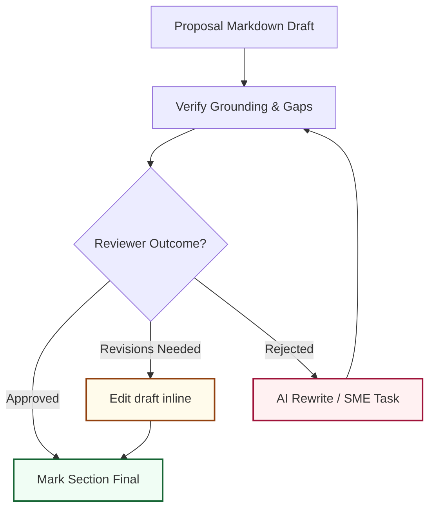
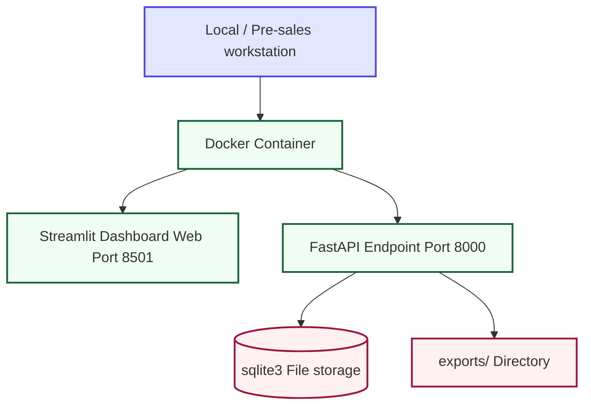

# BidForge AI — Bid Decision, Compliance, & Proposal Automation Platform

> **BidForge AI** is a production-oriented, local-first opportunity intelligence and proposal automation platform for RFPs, RFIs, RFQs, grants, tender calls, security questionnaires, and client briefs. It operates as an **AI proposal team in a box**, guiding capture managers, freelancers, and pre-sales engineers from intake parsing through compliance validation, RAG groundings, red-team auditing, and package exports.

---

## Why BidForge AI Exists

Most public RFP automation tools focus strictly on static answer-library management or simple chatbot generation. BidForge AI target critical market gaps by handling the **complete bid lifecycle**:
1. **Multi-Workspace Partitioning**: Segment opportunities and assets between different agency, corporate, or freelancer profiles.
2. **Scan-Aware Ingestion**: PDF size validations with OCR scanning fallbacks for image-only documents.
3. **Rigorous Decision Engine**: Calculate fit and risk ratings across 16 capability sliders *before* writing drafts.
4. **Hybrid RAG Evidence Grounding**: Leverage local TF-IDF matrices alongside cloud embeddings (Gemini/OpenAI) to match requirements to past projects.
5. **Git-Like Version Timelines**: Save proposal draft edits, view side-by-side versions, and restore rollbacks from the database.
6. **Programmatic API & Extension**: Query 20+ REST endpoints or use the loadable Chrome helper extension to autofill forms in online procurement portals.

---

## 📂 Folder Structure

```text
bidforge-ai/
├── app.py                     # Streamlit Frontend Web App Dashboard
├── src/
│   ├── config.py              # Configuration Loader & Environment variables
│   ├── database.py            # SQLite persistent database schema and seeding script
│   ├── document_loader.py     # PDF, DOCX, TXT structure text parser
│   ├── ocr.py                 # Scanned PDF/Image OCR scanner pipeline
│   ├── llm_clients.py         # Unified multi-provider LLM adapter with mock engine
│   ├── agents.py              # Agent prompt architectures & DB run tracing
│   ├── orchestrator.py        # Multi-agent workflow coordinator
│   ├── retrieval.py           # Local TF-IDF & dense embeddings retriever
│   ├── schemas.py             # Pydantic structured output models
│   └── api.py                 # FastAPI backend REST application
├── browser-extension/         # Chrome Extension autocompleter helper files
│   ├── manifest.json          # Extension permission manifest
│   ├── popup.html             # Extension selector view layout
│   ├── popup.js               # Extension API connector
│   └── content.js             # Document field autofiller script
├── tests/
│   ├── test_db.py             # SQLite CRUD tests
│   ├── test_scoring.py        # Rating model calculations
│   ├── test_document_loader.py# File validation tests
│   ├── test_api.py            # FastAPI route tests
│   ├── test_ocr.py            # OCR fallback checks
│   └── test_versioning.py     # Proposal version diff restore tests
├── .env.example               # Environment variables template
├── .gitignore                 # Excluded directories filters
├── requirements.txt           # Python package dependencies
└── README.md                  # System documentation
```

---

## 🎨 Architectural Diagrams

### 1. System Architecture



### 2. Full Bid Lifecycle Workflow



### 3. Ingestion & Requirement Extraction



### 4. Bid / No-Bid Rating Logic



### 5. Red-Team Review Pipeline



### 6. Deployment Topology



---

## 🛠️ Setup & Installation

### 1. Python Environment Setup
Install Python 3.9+ and execute the following commands in the project folder:

```bash
# Clone & enter directory
git clone <REPO_URL>
cd bidforge-ai

# Create and activate virtual environment
python -m venv .venv
# On Windows PowerShell:
.\.venv\Scripts\Activate.ps1
# On Mac/Linux:
source .venv/bin/activate

# Install required packages
pip install -r requirements.txt
```

### 2. Run the Workspace
```bash
streamlit run app.py
```
This initializes the Streamlit human-in-the-loop dashboard (on port `8501`) and triggers the FastAPI REST endpoints (on port `8000`) simultaneously in the background.

---

## ⚙️ Configuration & Credentials

Setup your `.env` configuration:

```env
APP_MODE=local
MOCK_MODE=true # Toggle false to connect live API keys
LLM_PROVIDER=mock

# Gemini configuration
GEMINI_API_KEY=
GEMINI_MODEL=gemini-1.5-flash

# OpenAI configuration
OPENAI_API_KEY=
OPENAI_MODEL=gpt-4o-mini

# Anthropic configuration
ANTHROPIC_API_KEY=
ANTHROPIC_MODEL=claude-3-5-sonnet-latest

# Groq configuration
GROQ_API_KEY=
GROQ_MODEL=llama-3.1-70b-versatile
```

If `MOCK_MODE=true` is set, the application operates fully offline. It will dynamically generate mock context, requirement IDs, compliance matrices, and proposal sections based on keywords found inside the briefs.

---

## 📖 Advanced Features Setup

### 1. Scanning with OCR
To parse image-only scanned PDFs, the pipeline uses `tesseract` and `pdf2image`. 
If these system packages are missing, the system will gracefully issue a system notice banner and continue parsing with normal text loaders. To enable OCR:
- **Windows**: Install [Tesseract OCR](https://github.com/UB-Mannheim/tesseract/wiki) and add it to your System PATH variables. Download [poppler-windows](http://blog.alivate.com.au/poppler-windows/) and add the `bin/` directory to PATH.
- **Mac**: Run `brew install tesseract poppler`
- **Linux**: Run `sudo apt-get install tesseract-ocr poppler-utils`

### 2. Installing the Chrome Autocompleter Extension
1. Open Google Chrome.
2. Navigate to `chrome://extensions/` and enable **Developer Mode** (top-right toggle).
3. Click **Load unpacked** (top-left button).
4. Select the `browser-extension/` directory inside this repository.
5. Focus any text field in a procurement portal page, open the extension popup, select your active opportunity, and click any RAG compliance answer to auto-fill the form field instantly.

### 3. Git-Like Version Diffs
When editing a proposal draft section under **Proposal Builder**:
- Click **Save Draft Changes** to automatically log the current draft state as a version index.
- Use the **Version Control History** box below the editor to select historic timestamps, compare texts side-by-side, and restore previous versions.

### 4. Hybrid Semantic Retrieval
When API keys for Gemini or OpenAI are configured, the **Evidence Mapping** page automatically queries dense vectors using:
- `text-embedding-004` (Gemini)
- `text-embedding-3-small` (OpenAI)
If API keys are absent or Mock Mode is enabled, the index falls back to sparse TF-IDF vectors, ensuring zero-cost matching runs smoothly.

---

## 🧪 Testing
Run the complete unit and regression test suite:

```bash
python -m pytest
```

---

## 🌐 Backend REST Endpoints
Programmatic interactions are supported via port `8000`. You can inspect the Swagger interface at `http://127.0.0.1:8000/docs`.

#### Python Programmatic Fetch Sample
```python
import requests

# Fetch pipeline opportunities from local sqlite database
response = requests.get("http://127.0.0.1:8000/api/opportunities")
print(response.json())
```

---

## ⚖️ License
Licensed under the [MIT License](LICENSE).
