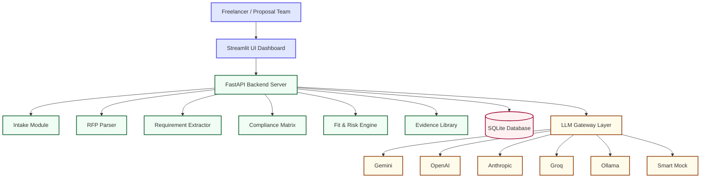
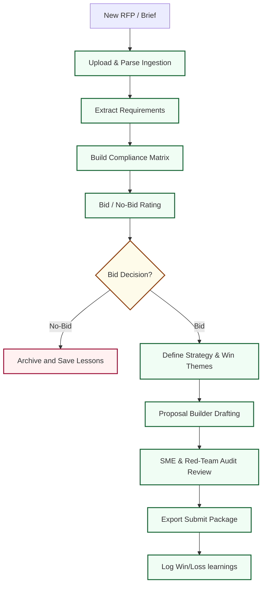
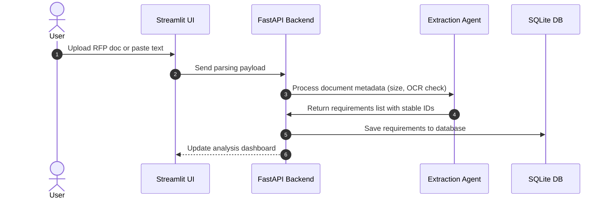
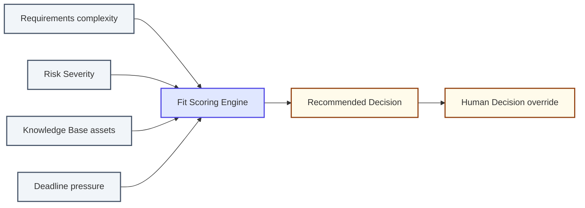
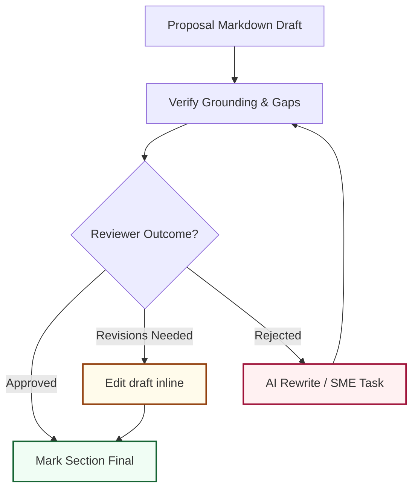
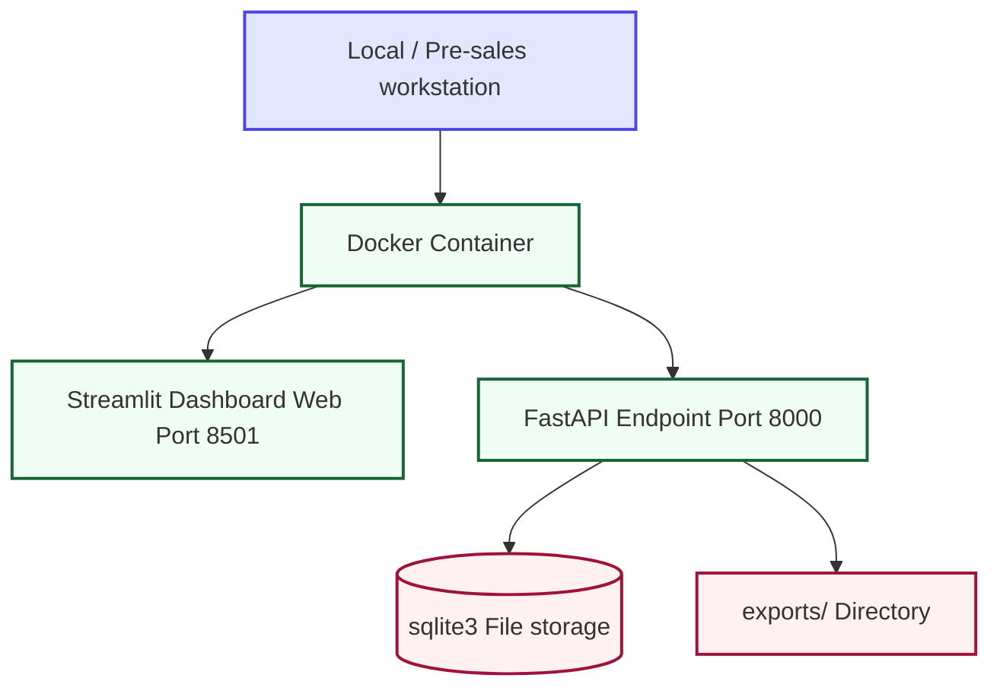

# BidForge AI — Bid Decision & Proposal Automation Platform

> **BidForge AI** is an AI-powered opportunity-intelligence and proposal-automation platform for RFPs, RFIs, RFQs, grants, freelance jobs, security questionnaires, and client proposals. It functions as a **proposal team in a box**, taking opportunities from initial intake through compliance mapping, scoring, drafting, human review, and final package exports.

---

## Why BidForge AI Exists

Enterprise proposal managers have heavy platforms with bloated answer libraries, but small teams, freelancers, SaaS sales teams, and agencies are left copy-pasting answers into generic chatbots. 

BidForge AI closes this gap by focusing on the **entire bid lifecycle**:
1. **Intake & Validation**: Ingesting files with integrity checks (detecting empty briefs or scanned PDFs).
2. **Requirements Extraction**: Assigning stable IDs and source context to mandatory vs optional items.
3. **Evidence groundings**: Grounding claims in a reusable capability library using RAG similarity matching.
4. **Bid/No-Bid Decisioning**: Empowering users to rating fit score criteria before writing a single line.
5. **Review Checklists**: Forcing a Red-Team review gate prior to document downloads.

---

## Folder Structure

```text
bidforge-ai/
├── app.py                     # Streamlit Frontend Web App
├── src/
│   ├── config.py              # Configuration & Environment loader
│   ├── database.py            # SQLite database schema and seeding script
│   ├── document_loader.py     # PDF, DOCX, TXT parser validation
│   ├── llm_clients.py         # Unified LLM provider gateway with fallbacks & mock mode
│   ├── agents.py              # Agent prompts for requirements, compliance, strategy
│   ├── orchestrator.py        # Multi-agent coordination logic
│   ├── retrieval.py           # TF-IDF local RAG index search
│   ├── schemas.py             # Pydantic models for structured outputs
│   ├── exporter.py            # DOCX, CSV exporter utilities
│   └── api.py                 # FastAPI background REST endpoints
├── tests/
│   ├── test_db.py             # Database CRUD tests
│   ├── test_scoring.py        # Decision weight tests
│   ├── test_document_loader.py# Ingestion parser tests
│   └── test_api.py            # FastAPI integration tests
├── .env.example               # Environment template
├── .gitignore                 # Secure files filter
├── requirements.txt           # Package dependencies
└── README.md                  # Project documentation
```

---

## Colorful Architectural Diagrams

### 1. BidForge AI System Architecture



### 2. Full Bid Lifecycle Workflow



### 3. Ingestion & Requirement Extraction



### 4. Bid / No-Bid Rating Logic



### 5. Red-Team Review Pipeline



### 6. Deployment Topology



---

## Setup & Ingesting

### Prerequisites

Verify that python is installed:
```bash
python --version
```

### Installation

1. Clone the repository and navigate into it:
   ```bash
   git clone <REPO_URL>
   cd bidforge-ai
   ```

2. Copy the environment variables:
   ```bash
   cp .env.example .env
   ```

3. Install required packages:
   ```bash
   pip install -r requirements.txt
   ```

4. Run the Streamlit application:
   ```bash
   streamlit run app.py
   ```
   Both the Streamlit UI and the background FastAPI server (on port 8000) will start automatically.

---

## Configuration Settings

Configure LLM keys inside `.env`:

```env
APP_MODE=local
MOCK_MODE=true

# Model choice configuration
LLM_PROVIDER=mock

GEMINI_API_KEY=
GEMINI_MODEL=gemini-1.5-flash

OPENAI_API_KEY=
OPENAI_MODEL=gpt-4o-mini

ANTHROPIC_API_KEY=
ANTHROPIC_MODEL=claude-3-5-sonnet-latest

GROQ_API_KEY=
GROQ_MODEL=llama-3.1-70b-versatile

DATABASE_URL=sqlite:///bidforge.db
MAX_UPLOAD_MB=50
ENABLE_OCR=false
ENABLE_DEMO_DATA=true
```

To run offline, leave `MOCK_MODE=true` and `LLM_PROVIDER=mock`. The system will parse documents heuristically and generate appropriate, contextual mock responses.

---

## API Documentation

The background API server exposes Swagger endpoints on `http://127.0.0.1:8000`.

- `GET /health`: Check backend services status.
- `GET /api/opportunities`: Fetch pipeline details.
- `POST /api/opportunities/{id}/extract-requirements`: Parse document text and extract constraints.
- `PATCH /api/compliance-matrix/items/{id}`: Modify compliance check decisions directly.

---

## Testing Guide

Execute the unit tests:

```bash
pytest
```

---

## Roadmap

- [ ] SharePoint / Google Drive auto-sync connectors
- [ ] Multi-tenant workspace RBAC permissions
- [ ] Browser extension for portal autocompletion
- [ ] PDF OCR parser engine integration

---

## License

This project is licensed under the MIT License.
